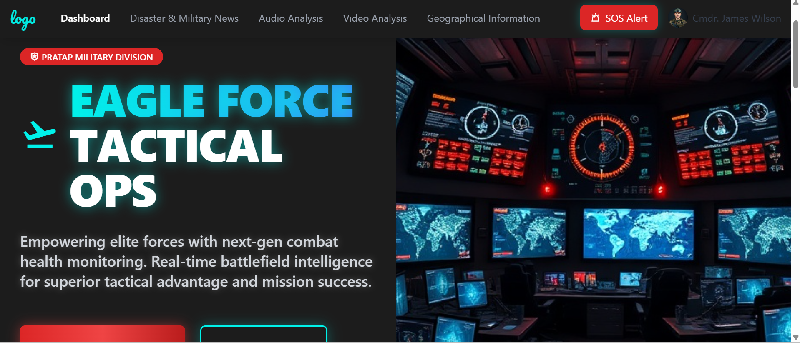

# **🚀 Military Support System**

## **📌 Overview**
Modern military operations require **real-time health monitoring, battlefield surveillance, and AI-driven intelligence analysis**. However, existing systems operate in silos, leading to inefficiencies in soldier safety and operational effectiveness.

## 🖼️ Dashboard UI Preview  

### **🎯 Our Solution**
We present an **end-to-end Military Support System** that integrates **IoT, AI, ML, and geospatial technologies** to enhance mission efficiency, soldier health, and intelligence accuracy.

### **🔹 Key Features**
✅ **IoT-Based Wearables** – Smart bands for real-time vitals monitoring (SpO2, heart rate, oxygen levels).  
✅ **OxiTech Emergency Ventilator** – IoT-enabled portable ventilator for critical respiratory support.  
✅ **Geospatial Tracking** – Live battlefield mapping for improved situational awareness.  
✅ **AI Video Intelligence** – Thermal imaging and object detection for identifying threats.  
✅ **Audio Analysis** – Environmental noise filtering for better communication and intelligence gathering.  
✅ **AI-Powered Military News Platform** – Aggregates military-related news and detects fake news.

---

## **💰 Revenue Model**
Our revenue model includes multiple streams to ensure financial sustainability:

### **1️⃣ Direct Sales**
- **IoT Wearables & OxiTech Emergency Ventilator** for defense agencies, hospitals, and private security.
- **AI-Powered Surveillance Systems** for government and military use.

### **2️⃣ Subscription Model**
- **Cloud-Based Battlefield Intelligence Platform** (SaaS model for data analytics & threat detection).
- **Geospatial Mapping & Soldier Health Dashboard** for army units and emergency response teams.

### **3️⃣ Licensing & Partnerships**
- **Licensing AI Threat Detection Technology** to defense contractors and intelligence agencies.
- **Partnering with Healthcare & Emergency Response Sectors** for non-military applications.

### **4️⃣ Government Contracts & Grants**
- Funding from defense R&D programs.
- Custom development for national security projects.

---

## **📊 Competitor Analysis**

| **Competitor**             | **IoT-Based Wearables** | **OxiTech Emergency Ventilator** | **Health Monitoring** | **AI Intelligence** | **Geospatial Tracking** | **Threat Detection** |
|---------------------------|------------------------|--------------------------------|---------------------|--------------------|------------------------|--------------------|
| **Hexoskin**              | ✅ Yes (Wearables) | ❌ No ventilator | ✅ Vitals Tracking | ❌ No AI analytics | ❌ No geospatial tracking | ❌ No threat detection |
| **Palantir**              | ❌ No IoT integration | ❌ No ventilator | ❌ No soldier vitals tracking | ✅ AI-powered battlefield analytics | ✅ Strong battlefield analytics | ❌ No real-time threat detection |
| **FLIR Systems**          | ❌ No IoT integration | ❌ No ventilator | ❌ No health monitoring | ❌ Limited AI intelligence | ❌ No battlefield tracking | ✅ Thermal imaging for threats |
| **Booz Allen Hamilton**   | ❌ No IoT integration | ❌ No ventilator | ❌ No soldier vitals tracking | ✅ Advanced defense analytics | ❌ No live tracking | ❌ No integrated AI threat detection |
| **Our Solution**          | ✅ Yes (IoT-enabled) | ✅ Yes (Portable ventilator) | ✅ Real-time vitals tracking | ✅ AI-driven intelligence | ✅ Live geospatial tracking | ✅ Object & thermal-based threat detection |

---

## **🌟 Unique Selling Points (USP)**

🔹 **Fully Integrated System** – Unlike competitors, we combine **IoT, AI, ML, and geospatial tracking** in a single platform.  
🔹 **Dual-Purpose Wearables & Ventilator** – Our IoT bands and ventilator serve **both military and civilian applications** (hospitals, emergency responders).  
🔹 **AI-Powered Threat Detection** – Detects threats **even behind obstacles** using **thermal & object recognition technology**.  
🔹 **Scalable & Modular** – Can be customized for different military and security needs.  
🔹 **Real-Time Battlefield Analytics** – Enables commanders to **make data-driven decisions** on the field.  

---

## **🌍 Market Opportunity**

The defense and security technology industry is booming, with key market trends supporting our innovation:

- **Global Military IoT Market** 🌐 – Expected to surpass **$89 billion by 2030**.
- **Healthcare Wearables Market** 🏥 – Expected to reach **$265 billion by 2030**.
- **Geospatial Intelligence Market** 🛰️ – Projected to reach **$143 billion by 2028**.
- **AI-Based Defense Systems** 🤖 – Over **$20+ billion invested globally**.

Our solution is positioned at the intersection of these growing markets, providing an **unmatched combination of battlefield safety, real-time intelligence, and scalable AI-driven security solutions**.

---

## **🚀 Future Roadmap**
📌 **Expand AI Threat Detection Capabilities** – Improve **real-time analysis and predictive analytics**.  
📌 **Integration with AR/VR** – Enable **enhanced tactical training simulations**.  
📌 **Blockchain-Based Secure Data Storage** – Ensure **highly secure and tamper-proof intelligence storage**.  
📌 **Commercial Expansion** – Apply the technology to **civil security, disaster response, and remote healthcare monitoring**.  

---

📢 **Join us in revolutionizing modern defense technology!** 🇮🇳🔥

